# 📊 Exen Protocol - System Diagrams

This document contains comprehensive system architecture and data flow diagrams for the Exen Protocol, rendered using Mermaid diagrams for optimal GitHub compatibility.

## 🏗️ System Architecture Overview

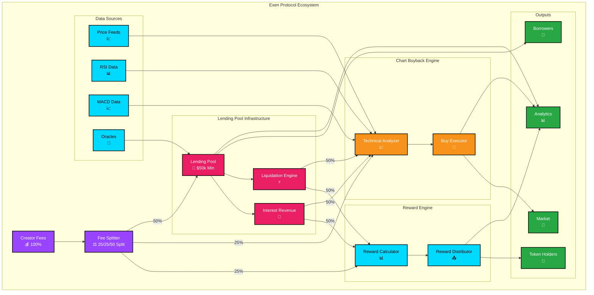

## 🔄 Data Flow Architecture

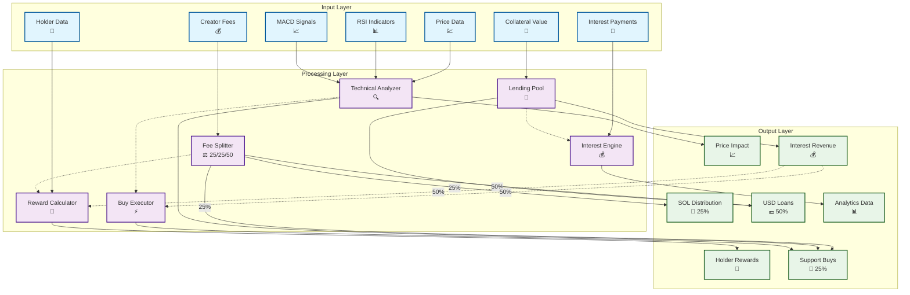

## 🧠 Technical Analysis Decision Flow

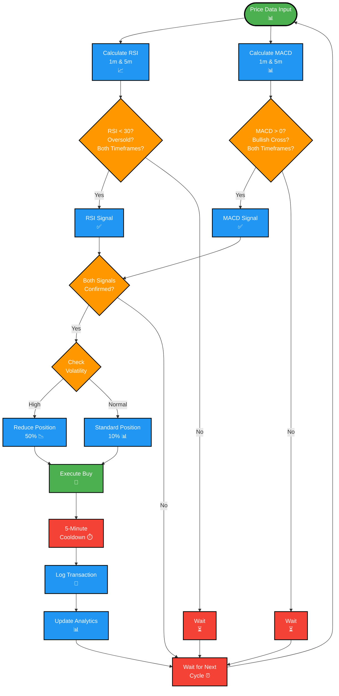

## 🏦 Lending Pool Flow

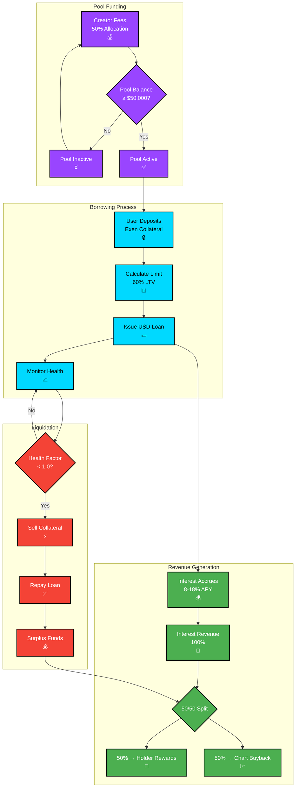

## 💰 Fee Distribution Flow

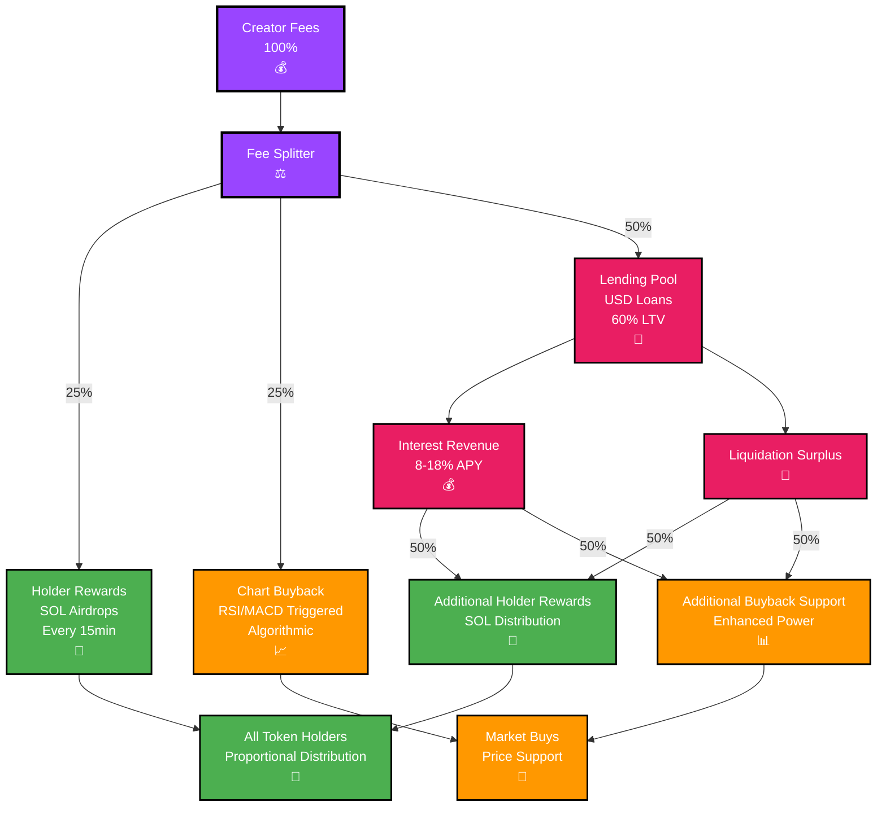

## 📊 Complete Revenue Flow Diagram

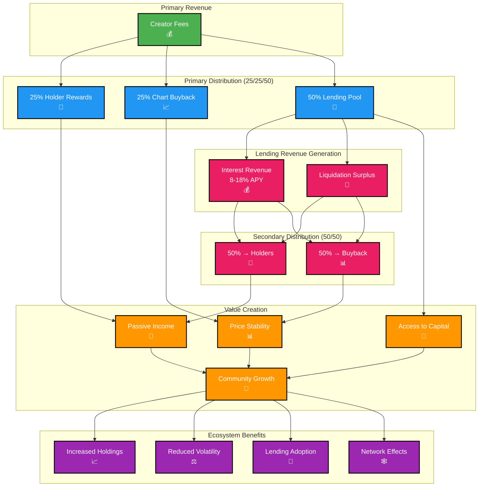

## 🎯 Protocol Performance Metrics

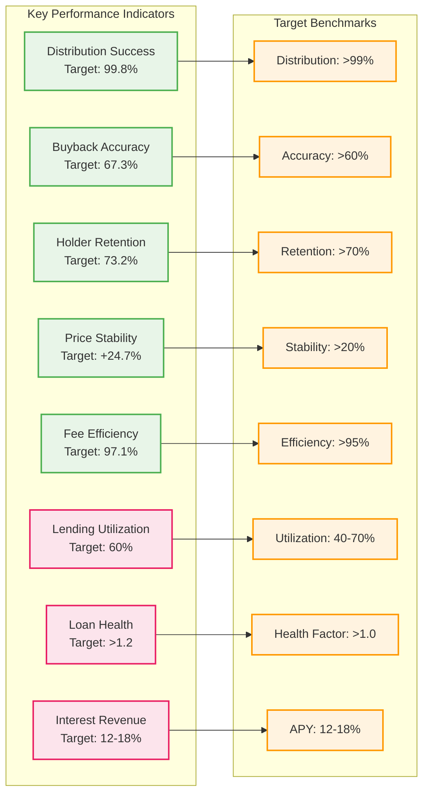

## 🌐 Ecosystem Stakeholder Map

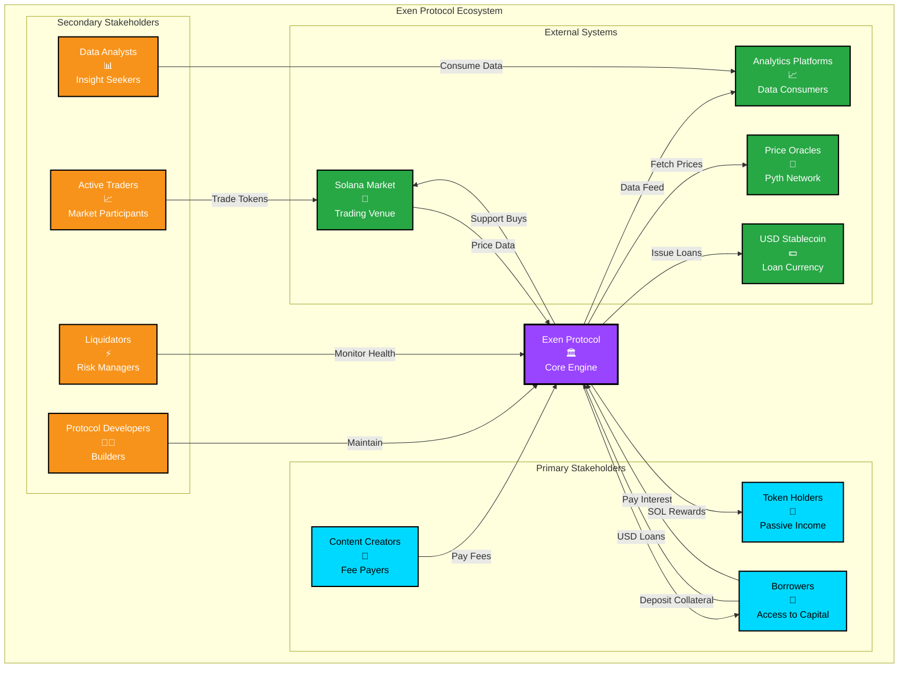

## ⚡ Real-Time Processing Timeline

```mermaid
gantt
    title Exen Protocol Processing Timeline
    dateFormat X
    axisFormat %M:%S
    
    section Reward Cycle
    Collect Fees          :active, fees, 0, 30s
    Calculate Rewards    :calc, after fees, 15s
    Distribute SOL       :dist, after calc, 45s
    
    section Buyback Cycle
    Analyze Market       :analyze, 0, 45s
    RSI/MACD Signals     :signals, after analyze, 15s
    Execute Buys         :execute, after signals, 30s
    Cooldown Period      :cooldown, after execute, 300s
    
    section Lending Operations
    Process Collateral   :collateral, 0, 60s
    Issue Loans          :loans, after collateral, 30s
    Accrue Interest      :interest, 0, 900s
    Monitor Health       :health, 0, 900s
    
    section Data Processing
    Update Analytics     :analytics, 0, 90s
    Log Transactions     :logging, 0, 90s
    Monitor Performance  :monitor, 0, 90s
```

## 🔧 Smart Contract Architecture

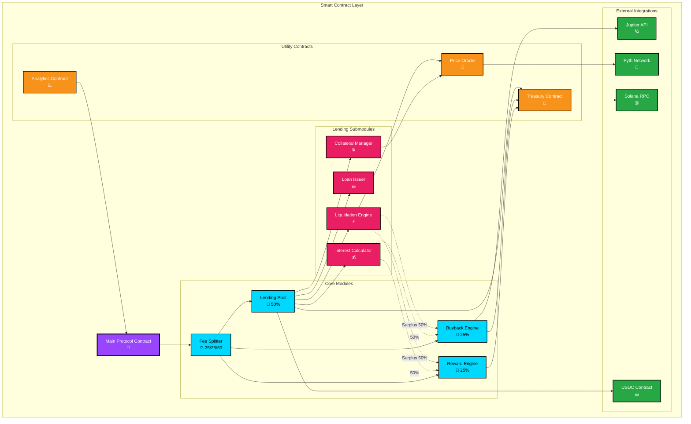

## 📈 Lending Pool Mechanics

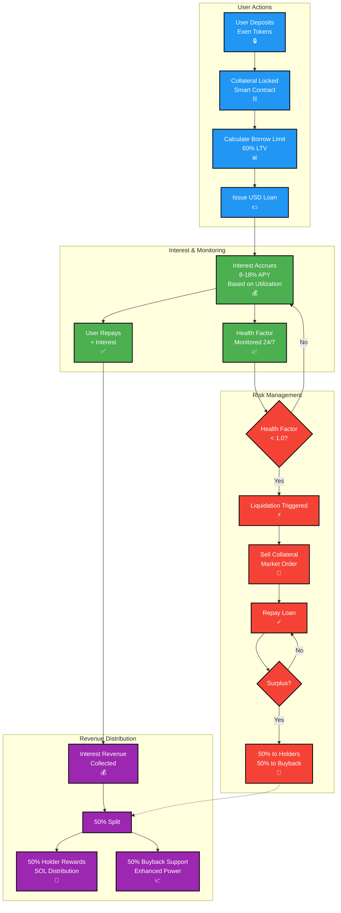

## 🎯 Success Metrics Dashboard

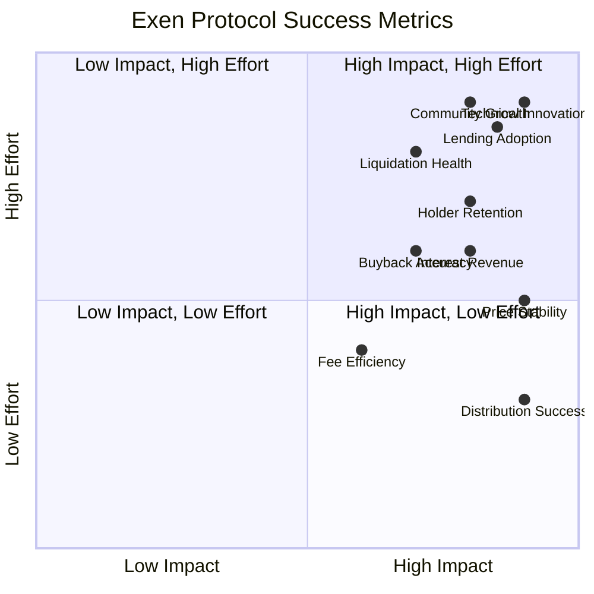

## 💵 Lending Pool Lifecycle

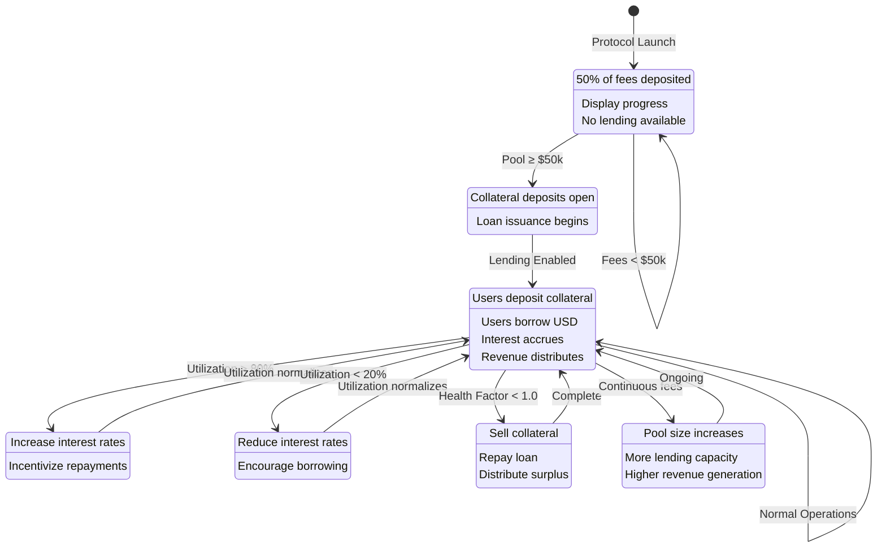

## 🔄 Interest Revenue Cycle

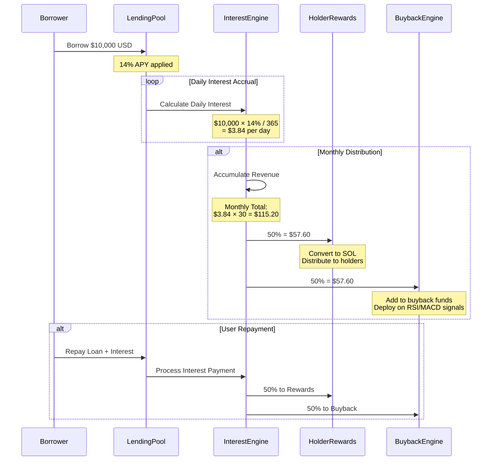

## 📊 Comprehensive Value Flow

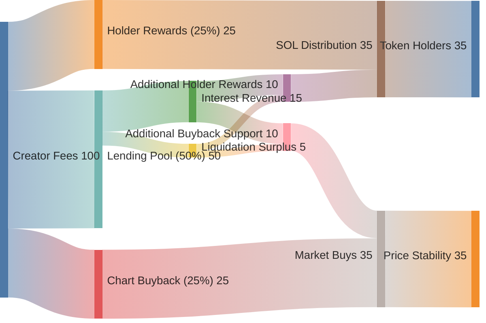

---

## 📋 Diagram Usage

These diagrams are designed to be:

- **GitHub Compatible**: All diagrams use Mermaid syntax for perfect GitHub rendering
- **Interactive**: Click and explore relationships in supported viewers
- **Comprehensive**: Cover all aspects of the 25/25/50 split and lending infrastructure
- **Maintainable**: Easy to update as the protocol evolves
- **Professional**: Clean, consistent styling throughout

## 🔄 Updating Diagrams

To update these diagrams:

1. Modify the Mermaid code in this document
2. Test rendering in GitHub or Mermaid Live Editor
3. Update corresponding documentation as needed
4. Version control all changes

## 📖 Diagram Legend

### Color Coding
- **Purple (#9945FF)**: Main protocol components
- **Cyan (#00D9FF)**: Reward engine and data sources
- **Orange (#F7931A)**: Chart buyback and technical analysis
- **Pink (#e91e63)**: Lending pool infrastructure
- **Green (#28a745)**: Outputs and success metrics
- **Blue (#2196f3)**: Processing and user actions
- **Red (#f44336)**: Risk management and liquidations

### Icons Used
- 💰 Money/Fees
- ⚖️ Balance/Splitting
- 📊 Analysis/Metrics
- 📈 Charts/Growth
- 🏦 Banking/Lending
- 💸 Rewards/Distribution
- 🛒 Buying/Trading
- 👥 Users/Holders
- 🔒 Locked/Collateral
- ⚡ Liquidation/Action
- 💵 USD/Stablecoin
- 🔮 Oracles/Data
- ✅ Success/Confirmation

---

*Last updated: January 2025 - Exen Protocol v1.0*
