# 📊 Deep Protocol - System Diagrams

This document contains comprehensive system architecture and data flow diagrams for the Deep Protocol, rendered using Mermaid diagrams for optimal GitHub compatibility.

## 🏗️ System Architecture Overview

```mermaid
graph TB
    subgraph "Deep Protocol Ecosystem"
        CF[Creator Fees<br/>💰 100%]
        FS[Fee Splitter<br/>⚖️ 50/50 Split]
        
        subgraph "Reward Engine"
            RE[Reward Calculator<br/>📊]
            RD[Reward Distributor<br/>📤]
        end
        
        subgraph "Chart Support Engine"
            TA[Technical Analyzer<br/>📈]
            BE[Buy Executor<br/>🛒]
        end
        
        subgraph "Data Sources"
            PF[Price Feeds<br/>💹]
            RSI[RSI Data<br/>📊]
            MACD[MACD Data<br/>📈]
        end
        
        subgraph "Outputs"
            H[Token Holders<br/>👥]
            M[Market<br/>🏪]
            A[Analytics<br/>📊]
        end
    end
    
    %% Main flow
    CF --> FS
    FS --> RE
    FS --> TA
    
    %% Data flow
    PF --> TA
    RSI --> TA
    MACD --> TA
    
    %% Processing
    RE --> RD
    TA --> BE
    
    %% Outputs
    RD --> H
    BE --> M
    RD --> A
    BE --> A
    
    %% Styling
    classDef primary fill:#9945FF,stroke:#000,stroke-width:2px,color:#fff
    classDef secondary fill:#00D9FF,stroke:#000,stroke-width:2px,color:#000
    classDef accent fill:#F7931A,stroke:#000,stroke-width:2px,color:#fff
    classDef success fill:#28a745,stroke:#000,stroke-width:2px,color:#fff
    
    class CF,FS primary
    class RE,RD,PF,RSI,MACD secondary
    class TA,BE accent
    class H,M,A success
```

## 🔄 Data Flow Architecture

```mermaid
flowchart TD
    subgraph "Input Layer"
        A1[Creator Fees<br/>💰]
        A2[Price Data<br/>💹]
        A3[RSI Indicators<br/>📊]
        A4[MACD Signals<br/>📈]
        A5[Holder Data<br/>👥]
    end
    
    subgraph "Processing Layer"
        B1[Fee Splitter<br/>⚖️]
        B2[Reward Calculator<br/>🧮]
        B3[Technical Analyzer<br/>🔍]
        B4[Buy Executor<br/>⚡]
    end
    
    subgraph "Output Layer"
        C1[SOL Distribution<br/>💸]
        C2[Holder Rewards<br/>🎁]
        C3[Support Buys<br/>🛒]
        C4[Price Impact<br/>📈]
        C5[Analytics Data<br/>📊]
    end
    
    %% Input to Processing
    A1 --> B1
    A2 --> B2
    A3 --> B3
    A4 --> B3
    A5 --> B4
    
    %% Processing to Output
    B1 --> C1
    B1 --> C2
    B2 --> C2
    B3 --> C3
    B3 --> C4
    B4 --> C3
    B4 --> C5
    
    %% Cross connections
    B1 -.-> B2
    B3 -.-> B4
    
    %% Styling
    classDef input fill:#e1f5fe,stroke:#01579b,stroke-width:2px
    classDef process fill:#f3e5f5,stroke:#4a148c,stroke-width:2px
    classDef output fill:#e8f5e8,stroke:#1b5e20,stroke-width:2px
    
    class A1,A2,A3,A4,A5 input
    class B1,B2,B3,B4 process
    class C1,C2,C3,C4,C5 output
```

## 🧠 Technical Analysis Decision Flow

```mermaid
flowchart TD
    Start([Price Data Input<br/>📊]) --> RSI[Calculate RSI<br/>📈]
    Start --> MACD[Calculate MACD<br/>📊]
    
    RSI --> RSI_Check{RSI < 30?<br/>Oversold?}
    MACD --> MACD_Check{MACD > 0?<br/>Bullish?}
    
    RSI_Check -->|Yes| RSI_True[RSI Signal<br/>✅]
    RSI_Check -->|No| RSI_False[Wait<br/>⏳]
    
    MACD_Check -->|Yes| MACD_True[MACD Signal<br/>✅]
    MACD_Check -->|No| MACD_False[Wait<br/>⏳]
    
    RSI_True --> Both_Check{Both Signals<br/>True?}
    MACD_True --> Both_Check
    
    Both_Check -->|Yes| Execute[Execute Buy<br/>🛒]
    Both_Check -->|No| Wait[Wait for Next<br/>Cycle ⏰]
    
    RSI_False --> Wait
    MACD_False --> Wait
    
    Execute --> Log[Log Transaction<br/>📝]
    Log --> Update[Update Analytics<br/>📊]
    Update --> Wait
    
    Wait --> Start
    
    %% Styling
    classDef start fill:#4caf50,stroke:#000,stroke-width:3px,color:#fff
    classDef process fill:#2196f3,stroke:#000,stroke-width:2px,color:#fff
    classDef decision fill:#ff9800,stroke:#000,stroke-width:2px,color:#fff
    classDef success fill:#4caf50,stroke:#000,stroke-width:2px,color:#fff
    classDef wait fill:#f44336,stroke:#000,stroke-width:2px,color:#fff
    
    class Start start
    class RSI,MACD,RSI_True,MACD_True,Execute,Log,Update process
    class RSI_Check,MACD_Check,Both_Check decision
    class Execute success
    class RSI_False,MACD_False,Wait wait
```

## 💰 Fee Distribution Flow

## 🎯 Protocol Performance Metrics

## 🌐 Ecosystem Stakeholder Map

## ⚡ Real-Time Processing Timeline

## 🔧 Smart Contract Architecture

## 📈 Revenue Flow Analysis

## 🎯 Success Metrics Dashboard

---

## 📋 Diagram Usage

These diagrams are designed to be:

- **GitHub Compatible**: All diagrams use Mermaid syntax for perfect GitHub rendering
- **Interactive**: Click and explore relationships in supported viewers
- **Maintainable**: Easy to update as the protocol evolves
- **Professional**: Clean, consistent styling throughout

## 🔄 Updating Diagrams

To update these diagrams:

1. Modify the Mermaid code in this document
2. Test rendering in GitHub or Mermaid Live Editor
3. Update corresponding documentation as needed
4. Version control all changes

---

*Last updated: January 2025*
