# Exen Protocol - Decentralized Internet Banking Infrastructure

> **Building the future of finance: A protocol that rewards holders, supports chart health through algorithmic buybacks, AND enables permissionless on-chain lending—all simultaneously**

[](https://opensource.org/licenses/MIT)
[](https://solana.com/)
[](https://www.rust-lang.org/)
[](https://python.org/)

---

## 🌐 The Vision: Permissionless Finance Infrastructure

The internet economy demands true internet banking infrastructure. Today, most people cannot achieve full financial independence on-chain because traditional banks gatekeep capital access through legacy credit systems that ignore on-chain reputation and creditworthiness. **The infrastructure for decentralized underwriting barely exists.**

**Exen is building distributed internet banking infrastructure for the blockchain era.** We're constructing an internet-native lending system backed by on-chain reputation and transparent collateral mechanics—eliminating gatekeepers from determining who deserves access to capital.

### Why This Matters

Money didn't originate from barter; it originated as **credit**. Money is fundamentally a **social ledger**—a record of who owes what to whom. To achieve true independence from fiat banking, we need a decentralized social ledger where:

- ✅ **Trust is earned on-chain** through participation and collateral backing
- ✅ **Credit decisions are algorithmic**, not discretionary
- ✅ **All participants share in protocol profits** through interest revenue redistribution
- ✅ **Collateral is verifiable** and liquidation is transparent
- ✅ **Access is permissionless** - no institution approval required

Most leading research confirms that DeFi still lacks reliable reputation-based lending mechanisms. **Exen solves this** by creating a transparent, algorithmic lending system where every participant benefits from the ecosystem's success.

**We are building the financial infrastructure that enables the next billion people to access capital without permission from centralized banks.**

---

## 🎯 What Makes Exen Different

While other protocols either reward holders OR support their chart, Exen does **three transformative things simultaneously** through an innovative 25/25/50 fee split system that creates sustainable value for the entire community:

### ⚡ Real-Time Holder Rewards
- **SOL airdrops every 15 minutes** to all token holders
- **No staking required** - just hold and earn passive income
- **100% of holders included** - proportional to token holdings
- **Transparent on-chain distribution** with verified calculations

### 📈 Intelligent Algorithmic Chart Support
- **Continuous buyback pressure** using advanced technical analysis
- **Multi-timeframe analysis**: RSI, MACD on 1m & 5m timeframes
- **Automated support at key levels** to maintain chart health
- **Risk-managed execution** with position sizing and stop losses

### 🏦 Permissionless Decentralized Lending
- **Borrow USD stablecoins** by collateralizing Exen tokens
- **No credit checks required** - algorithmic underwriting only
- **Dynamic interest rates** (12-18% APY based on market conditions)
- **60% maximum LTV ratio** for conservative risk management
- **Smart liquidation mechanics** that protect both borrowers and protocol
- **ALL lending revenue redistributed** - 50% to holder rewards, 50% to chart buyback

---

## 🏗️ System Architecture Overview

### High-Level Data Flow Map


---

## 🔄 Complete Data Pipeline Architecture

### 1️⃣ Fee Processing Pipeline

```mermaid
flowchart LR
    subgraph Input["Fee Input Stream"]
        F1[Creator Fees<br/>Collected<br/>💰]
        F2[Lending Interest<br/>Accrued<br/>💵]
    end
    
    subgraph Pipeline["Fee Split Pipeline"]
        S1[Aggregate Fees<br/>🔢]
        S2[Calculate Splits<br/>25/25/50<br/>⚖️]
        S3[Route to Engines<br/>🔀]
    end
    
    subgraph Output["Distribution Targets"]
        O1[Reward Engine<br/>25%<br/>👥]
        O2[Chart Support<br/>25%<br/>📈]
        O3[Lending Pool<br/>50%<br/>🏦]
    end
    
    F1 --> S1
    F2 --> S1
    S1 --> S2
    S2 --> S3
    S3 --> O1
    S3 --> O2
    S3 --> O3
    
    classDef input fill:#9945FF,stroke:#000,stroke-width:2px,color:#fff
    classDef process fill:#00D9FF,stroke:#000,stroke-width:2px,color:#000
    classDef output fill:#14F195,stroke:#000,stroke-width:2px,color:#000
    
    class F1,F2 input
    class S1,S2,S3 process
    class O1,O2,O3 output
```



### 2️⃣ Holder Rewards Pipeline


### 3️⃣ Chart Support Technical Analysis Pipeline


### 4️⃣ Lending Pool Pipeline

```mermaid
flowchart TD
    subgraph Accumulation["Pool Accumulation Phase"]
        A1[Fee Allocation<br/>50% Share<br/>💰]
        A2[Interest Repayments<br/>From Borrowers<br/>💵]
        A3[Aggregate Pool<br/>Track Balance<br/>📊]
        A4{Balance ≥<br/>$50,000?}
    end
    
    subgraph BorrowRequest["Loan Request Pipeline"]
        B1[User Deposits Exen<br/>Collateral<br/>🔐]
        B2[Fetch Price Oracle<br/>Pyth Network<br/>🔮]
        B3[Calculate LTV<br/>60% Max<br/>🧮]
        B4[Verify Limits<br/>$500k Cap<br/>✅]
        B5[Check Pool Liquidity<br/>Available USD<br/>💧]
    end
    
    subgraph Underwriting["Algorithmic Underwriting"]
        U1[Calculate Health Factor<br/>Collateral/Debt<br/>📈]
        U2[Set Interest Rate<br/>12-18% APY<br/>💹]
        U3[Generate Loan Terms<br/>Smart Contract<br/>📜]
        U4[User Approval<br/>Sign Transaction<br/>✍️]
    end
    
    subgraph Disbursement["Loan Disbursement"]
        D1[Lock Collateral<br/>Vault Contract<br/>🔒]
        D2[Mint Debt Position<br/>NFT Record<br/>🎫]
        D3[Transfer USDC/USDT<br/>To Borrower<br/>💸]
        D4[Record On-Chain<br/>Transaction Log<br/>📝]
    end
    
    subgraph Monitoring["Continuous Monitoring"]
        MO1[Real-Time Price Feeds<br/>Every Block<br/>⏱️]
        MO2[Calculate Health Factor<br/>Live Updates<br/>📊]
        MO3{Health < 1.0?<br/>Liquidate?}
        MO4[Alert Dashboard<br/>⚠️]
    end
    
    subgraph InterestAccrual["Interest Accrual Pipeline"]
        I1[Calculate Daily Interest<br/>Per Position<br/>💵]
        I2[Accrue to Pool<br/>Revenue<br/>📈]
        I3[Split 50/50<br/>⚖️]
        I4[→ Holder Rewards<br/>50%<br/>👥]
        I5[→ Chart Buyback<br/>50%<br/>📈]
    end
    
    A1 --> A3
    A2 --> A3
    A3 --> A4
    A4 -->|Yes| BorrowRequest
    A4 -->|No| A3
    
    B1 --> B2
    B2 --> B3
    B3 --> B4
    B4 --> B5
    
    B5 --> U1
    U1 --> U2
    U2 --> U3
    U3 --> U4
    
    U4 --> D1
    D1 --> D2
    D2 --> D3
    D3 --> D4
    
    D4 --> MO1
    MO1 --> MO2
    MO2 --> MO3
    MO3 -->|No| MO4
    MO3 -->|Yes| Liquidation
    
    MO2 --> I1
    I1 --> I2
    I2 --> I3
    I3 --> I4
    I3 --> I5
    
    subgraph Liquidation["Liquidation Pipeline"]
        L1[Trigger Liquidation<br/>Health < 1.0<br/>🚨]
        L2[Sell Collateral<br/>DEX Market Order<br/>🛒]
        L3[Repay Debt<br/>From Proceeds<br/>💰]
        L4[Calculate Surplus<br/>Or Deficit<br/>🧮]
        L5[Distribute Surplus<br/>50/50 Split<br/>📊]
        L6[Burn Debt NFT<br/>Close Position<br/>🔥]
    end
    
    L1 --> L2
    L2 --> L3
    L3 --> L4
    L4 --> L5
    L5 --> L6
    L6 --> A3
    
    classDef accumulation fill:#9945FF,stroke:#000,stroke-width:2px,color:#fff
    classDef borrow fill:#00D9FF,stroke:#000,stroke-width:2px,color:#000
    classDef underwriting fill:#F7931A,stroke:#000,stroke-width:2px,color:#fff
    classDef disbursement fill:#14F195,stroke:#000,stroke-width:2px,color:#000
    classDef monitoring fill:#FF6B9D,stroke:#000,stroke-width:2px,color:#fff
    classDef interest fill:#CE422B,stroke:#000,stroke-width:2px,color:#fff
    classDef liquidation fill:#ff4444,stroke:#000,stroke-width:2px,color:#fff
    
    class A1,A2,A3,A4 accumulation
    class B1,B2,B3,B4,B5 borrow
    class U1,U2,U3,U4 underwriting
    class D1,D2,D3,D4 disbursement
    class MO1,MO2,MO3,MO4 monitoring
    class I1,I2,I3,I4,I5 interest
    class L1,L2,L3,L4,L5,L6 liquidation
```



### 5️⃣ Revenue Redistribution Pipeline


### 6️⃣ Analytics & Monitoring Pipeline


---

## 🚀 Quick Start

### Prerequisites
- Solana wallet (Phantom, Solflare, Backpack, etc.)
- SOL for transaction fees (~0.001-0.01 SOL per transaction)
- Basic understanding of DeFi concepts

### For Token Holders (Reward Earners)

**1. Acquire Exen Tokens**
```bash
# Buy $EXEN on any Solana DEX (Raydium, Magic Eden, etc.)
# You'll automatically start earning rewards once you hold tokens
```

**2. Passive Income Begins**
```bash
# Rewards automatically distributed every 15 minutes
# No actions required - just hold
# Track earnings in real-time dashboard
```

**3. Monitor Performance**
```bash
# View SOL rewards accumulated
# Track portfolio value
# Observe chart support in action
```

### For Borrowers (Lending Pool Users)

**1. Wait for Pool Activation** ⏳
```
Lending pool activates when $50,000 USD is accumulated
Current progress: [████░░░░░] 45% toward activation
```

**2. Deposit Collateral**
```bash
# Send Exen tokens to lending pool smart contract
# Tokens locked as collateral
# Borrow limit calculated: (Token Value) × 60% LTV
```

**3. Borrow USD Stablecoins**
```bash
# Borrow up to your calculated limit
# Pay interest at current market rate (12-18% APY)
# Interest revenue shared: 50% → holders, 50% → buyback
```

**4. Repay & Recover**
```bash
# Repay USD anytime at your pace
# Recover your Exen tokens + keep price appreciation
# If price rose: You benefit from the gain after repaying loan
```

### Installation (For Developers)

```bash
# Clone the repository
git clone https://github.com/exen-protocol/exen-core
cd exen-protocol

# Install dependencies
npm install

# Build smart contracts
npm run build:contracts

# Run tests
npm run test

# Start development server
npm run dev
```

---

## 📊 Key Metrics & Performance

| Metric | Value | Description |
|--------|-------|-------------|
| **Reward Frequency** | Every 15 minutes | SOL airdrops to all holders |
| **Fee Allocation** | 25% / 25% / 50% | Rewards / Buyback / Lending |
| **Holders Included** | 100% | All token holders rewarded |
| **Distribution Method** | Proportional | Based on token holdings |
| **Technical Indicators** | RSI, MACD | Multi-timeframe analysis |
| **Support Response** | Real-time | Automated buyback execution |
| **Lending Pool Min** | $50,000 USD | Activation threshold |
| **Maximum LTV Ratio** | 60% | Conservative collateral usage |
| **Per-User Borrow Cap** | $500,000 USD | Concentration risk protection |
| **Target APY** | 12-18% | Variable based on utilization |
| **Interest Distribution** | 50/50 | Split between holders & buyback |

---

## 🏦 Lending Pool Deep Dive

### How Decentralized Lending Works

**Traditional Banking Problem:**
- Banks decide who gets credit based on proprietary algorithms
- Credit decisions lack transparency
- Billions excluded from financial system
- Central institutions capture all lending profits

**Exen Solution:**
- Algorithmic, transparent credit decisions
- No gatekeepers or intermediaries
- All protocol participants share lending profits
- Collateral is verifiable on-chain

### Real-World Example

**Scenario: Alice Wants to Borrow USD**

```
Alice's Position:
├── Owns 1,000,000 Exen tokens
├── Current price: $0.10 per token
├── Collateral value: $100,000
├── Maximum borrow (60% LTV): $60,000
└── Borrow limit: $60,000

Pool Conditions:
├── Interest rate: 14% APY
├── Pool balance: $100,000
├── Total borrowed: $70,000
└── Utilization: 70%

Alice's Action:
├── Deposits 1,000,000 Exen as collateral
├── Borrows $50,000 USD
├── Pays 14% APY interest
└── Can repay anytime

What Happens Next:

IF PRICE RISES to $0.12:
├── Collateral now worth $120,000
├── Alice still owes $50,000
├── Surplus $20,000 stays with protocol
└── Protocol redirects surplus: $10k → holders, $10k → buyback

IF PRICE DROPS to $0.08:
├── Collateral worth $80,000
├── Alice still owes $50,000
├── Health factor still healthy (1.6x)
├── Protocol adjusts via buyback support
└── System remains stable
```

### Revenue Generation & Redistribution

```
Daily Interest Revenue Example:

Pool Statistics:
├── Total borrowed: $60,000
├── Average rate: 14% APY
├── Daily accrual: $60,000 × 14% ÷ 365 = $23.01

Revenue Split 50/50:
├── $11.51 → Converted to SOL & distributed to holders
│   └── Proportional to token holdings
│   └── Added to 15-minute reward cycles
│
└── $11.51 → Added to chart buyback support
    └── Deployed algorithmically
    └── Strengthens price floor
```

### Smart Liquidation Protection

```
Health Factor Monitoring:

SAFE ZONE:
├── Health Factor > 1.5: Comfortable position
├── No liquidation risk
└── Continue earning & borrowing

WARNING ZONE:
├── Health Factor 1.0-1.5: Monitor closely
├── Consider repaying partial debt
└── Adjust position to reduce risk

LIQUIDATION TRIGGERED:
├── Health Factor < 1.0
├── Collateral sold automatically
├── Debt repaid from sale proceeds
├── Surplus redistributed 50/50
└── User can recover remaining value

Example Liquidation:
├── Borrowed: $50,000
├── Collateral liquidated for: $55,000
├── Debt repaid: $50,000
├── Surplus: $5,000
│   ├── $2,500 → holder rewards
│   └── $2,500 → chart buyback
└── System remains profitable & healthy
```

---

## 🔧 Technical Specifications

- **Blockchain**: Solana (high-speed, low-cost settlement)
- **Smart Contract Language**: Rust (Anchor framework)
- **Analytics Engine**: Python (technical analysis library)
- **Distribution Engine**: Automated via smart contract every 15 minutes
- **Buyback Analysis**: Custom RSI/MACD algorithms with multi-timeframe confirmation
- **Lending Engine**: Collateral-based lending with dynamic LTV calculation
- **Price Feeds**: Pyth Network (real-time oracle integration)
- **Timeframes Analyzed**: 1-minute and 5-minute candles
- **Liquidation Trigger**: Health factor < 1.0
- **Risk Management**: Position sizing (10% max per trade), stop losses, high volatility adjustments

---

## 📈 Performance Tracking Dashboard

Our protocol maintains real-time metrics on:

### Holder Rewards Metrics
- Total SOL distributed (lifetime & period)
- Average reward per holder
- Distribution efficiency score
- Lending interest contribution to rewards

### Chart Support Metrics
- Buy signal accuracy rate
- Price impact analysis
- Support level success ratio
- Buyback power deployed
- Lending interest funding chart support

### Lending Pool Metrics
- Pool balance (USD available)
- Total collateral locked (Exen)
- Total borrowed (outstanding loans)
- Utilization rate
- Pool health ratio
- Interest revenue generated
- Default rate & liquidation events

### Overall Protocol Health
- Total fee generation
- Community growth rate
- Token stability index
- Lending adoption percentage
- Revenue reinvestment tracking
- Ecosystem sustainability score

---

## 🛡️ Security & Risk Management

### Security Measures
- ✅ **Regular Smart Contract Audits** by leading security firms
- ✅ **Multi-signature Treasury** for protocol funds
- ✅ **Transparent Fee Distribution** with on-chain verification
- ✅ **Open Source Code** - all auditable by community
- ✅ **Real-time Collateral Monitoring** with health factor tracking
- ✅ **Oracle Integration** via Pyth Network for accurate pricing
- ✅ **Liquidation Insurance** - protocol covers gap risk

### Risk Management Controls
- Conservative 60% LTV ratio (not 75% or higher)
- Per-user borrow caps ($500k USD maximum)
- Dynamic liquidation thresholds
- Position sizing limits (10% max per buyback)
- Multi-timeframe confirmation for buy signals
- High volatility adjustment mechanisms
- Low liquidity pause protocols

### Known Risks
⚠️ **Collateral Volatility**: Exen price fluctuations affect borrowing capacity  
⚠️ **Smart Contract Risk**: All code subject to technical risk (mitigated by audits)  
⚠️ **Market Risk**: Extreme market conditions may impact liquidation execution  
⚠️ **Oracle Risk**: Price feed manipulation potential (mitigated by Pyth security)  
⚠️ **Liquidation Cascades**: Rapid price movements could trigger multiple liquidations  

---

## 🤝 Contributing

We welcome contributions from the community! Whether you're a developer, analyst, security researcher, or just passionate about decentralized finance, there's a place for you.

### Development Setup
```bash
# Clone the repository
git clone https://github.com/exen-protocol/exen-core.git
cd exen-protocol

# Install dependencies
npm install

# Run the full test suite
npm run test

# Start local development environment
npm run dev

# Build for production
npm run build:prod
```

### Contribution Areas
- Smart contract optimization
- Technical analysis algorithm improvements
- Lending pool risk modeling
- UI/UX enhancements
- Documentation & guides
- Community translation
- Security research

Please see [CONTRIBUTING.md](CONTRIBUTING.md) for detailed guidelines.

---

## 📚 Documentation

- **[Strategy Deep Dive](docs/STRATEGY.md)** - Complete technical strategy explanation including all three engines
- **[Lending Pool Guide](docs/LENDING.md)** - Detailed borrowing, collateral, and liquidation mechanics
- **[Smart Contract API](docs/API.md)** - Smart contract methods and integration guide
- **[Analytics & Metrics](docs/METRICS.md)** - Dashboard, KPIs, and performance tracking
- **[Risk Management](docs/RISK.md)** - Liquidation procedures, collateral modeling, stress tests
- **[Developer Guide](docs/DEVELOPER.md)** - Building on top of Exen Protocol

---

## 💬 Community & Support

Join the Exen community and stay updated:

- **Discord**: [Exen Protocol Community](https://discord.gg/exen-protocol)
- **Twitter/X**: [@ExenProtocol](https://twitter.com/exen_protocol)
- **Telegram**: [Exen Protocol Chat](https://t.me/exen_protocol)
- **Website**: [exenprotocol.com](https://exenprotocol.com)
- **Docs**: [docs.exenprotocol.com](https://docs.exenprotocol.com)
- **GitHub**: [github.com/exen-protocol](https://github.com/exen-protocol)

### Getting Help
- **Technical Support**: GitHub Issues
- **Feature Requests**: GitHub Discussions
- **Community Questions**: Discord #help channel
- **Security Issues**: security@exenprotocol.com (please report privately)

---

## 📊 Protocol Statistics

```
Current State:
├── Total Fees Generated: $XXX,XXX
├── Total SOL Distributed: XXX SOL
├── Active Holders: X,XXX+
├── Lending Pool Progress: XX% toward $50k activation
├── Average APY Offered: 12-18%
└── Community Members: X,XXX+
```

---

## 📄 License

This project is licensed under the MIT License - see the [LICENSE](LICENSE) file for details.

---

## ⚖️ Legal Disclaimer

**Important**: The Exen Protocol involves financial risk. 

The Exen Protocol is provided "as-is" without warranties. By using this protocol, you acknowledge:

- ⚠️ **Risk of Loss**: Your capital is at risk, including from collateral price volatility
- ⚠️ **Smart Contract Risk**: Code may contain undiscovered vulnerabilities
- ⚠️ **Market Risk**: Crypto markets are highly volatile and unpredictable
- ⚠️ **Liquidation Risk**: Your collateral may be liquidated if conditions deteriorate
- ⚠️ **Regulatory Risk**: Laws governing crypto finance are evolving globally

**Only invest capital you can afford to lose completely.** Conduct thorough research and consult financial advisors if needed.

---

## 🚀 Join the Future of Finance

Exen Protocol is building the infrastructure for the next generation of permissionless, transparent, algorithmically-managed finance. 

**Where traditional finance asks "Are you creditworthy?" Exen Protocol asks "What can you collateralize?"**

Join us in building a financial system where access to capital isn't determined by institutions—it's determined by on-chain reputation, transparent collateral, and community participation.

**The future of banking is decentralized. The future is Exen.**

---

*Last updated: January 2025*

<div align="center">

**Built by the community. For the community. Forever permissionless.**

[Get Started](https://docs.exenprotocol.com/getting-started) • [Strategy](docs/STRATEGY.md) • [Community](https://discord.gg/exen-protocol)

</div>
