# 🚀 Exen Protocol - Multi-Engine Growth System

> **The first token protocol that rewards holders, supports chart health through algorithmic buybacks, AND enables decentralized lending all simultaneously**

```mermaid
graph TB
    subgraph "Exen Protocol Ecosystem"
        CF[Creator Fees<br/>💰 100%]
        FS[Fee Splitter<br/>⚖️ 25/25/50 Split]
        
        subgraph "Reward Engine"
            RE[Reward Calculator<br/>📊]
            RD[Reward Distributor<br/>📤]
        end
        
        subgraph "Chart Support Engine"
            TA[Technical Analyzer<br/>📈]
            BE[Buy Executor<br/>🛒]
        end
        
        subgraph "Lending Engine"
            LP[Lending Pool<br/>💳]
            LM[Loan Manager<br/>🔒]
        end
        
        subgraph "Outputs"
            H[Token Holders<br/>👥]
            M[Market<br/>🏪]
            B[Borrowers<br/>💰]
        end
    end
    
    %% Main flow
    CF --> FS
    FS --> RE
    FS --> TA
    FS --> LP
    RE --> RD
    TA --> BE
    LP --> LM
    RD --> H
    BE --> M
    LM --> B
    
    %% Styling
    classDef primary fill:#9945FF,stroke:#000,stroke-width:2px,color:#fff
    classDef secondary fill:#00D9FF,stroke:#000,stroke-width:2px,color:#000
    classDef accent fill:#F7931A,stroke:#000,stroke-width:2px,color:#fff
    classDef success fill:#28a745,stroke:#000,stroke-width:2px,color:#fff
    classDef lending fill:#FF6B9D,stroke:#000,stroke-width:2px,color:#fff
    
    class CF,FS primary
    class RE,RD secondary
    class TA,BE accent
    class LP,LM lending
    class H,M,B success
```



[](https://opensource.org/licenses/MIT)
[](https://solana.com/)
[](https://python.org/)

## 🎯 What Makes Us Different

While other projects either reward holders OR support their chart, we do **all three simultaneously** through an innovative 25/25/50 fee split system that creates sustainable value for the entire community.

### ⚡ Real-Time Rewards
- **SOL airdrops every 15 minutes** to all holders
- **No staking required** - just hold and earn
- **Transparent distribution** based on token holdings

### 📈 Intelligent Chart Support
- **Algorithmic buyback pressure** using advanced technical analysis
- **RSI, MACD, and multi-timeframe analysis** for optimal entry points
- **Automated support** at key technical levels to maintain chart health

### 🏦 Decentralized Lending
- **Borrow USD** by collateralizing your Exen tokens
- **Per-user borrow limits** with dynamic LTV calculations
- **Smart liquidation mechanics** that protect both borrowers and the protocol
- **Lending pool grows automatically** with 50% of creator fees

## 🏗️ Architecture Overview

```
Creator Fees (100%)
├── 25% → Direct SOL Rewards to Holders (Every 15 min)
├── 25% → Algorithmic Chart Buyback System
│   ├── RSI Analysis (1m & 5m timeframes)
│   ├── MACD Momentum Detection
│   └── Automated Buy Execution
└── 50% → Lending Pool Infrastructure ($50k Minimum)
    ├── User collateral deposits
    ├── USD stablecoin lending
    ├── Liquidation management
    └── Price appreciation reinforcement
```

## 🚀 Quick Start

### Prerequisites
- Solana wallet (Phantom, Solflare, etc.)
- SOL for gas fees
- Basic understanding of DeFi

### Getting Started - As a Holder
1. **Acquire Tokens**: Buy $EXEN tokens on any Solana DEX
2. **Hold & Earn**: Receive SOL rewards automatically every 15 minutes
3. **Monitor Performance**: Track both rewards and chart health in real-time
4. **Optional - Lending**: Deposit tokens as collateral to borrow USD

### Getting Started - As a Lender/Borrower
1. **Wait for Pool Activation**: Lending pool activates when $50k USD is reached
2. **Deposit Collateral**: Stake your Exen tokens to unlock borrowing power
3. **Borrow USD**: Take USD loans against your collateral (up to 75% LTV)
4. **Earn Spread**: Watch your collateral and protocol value appreciation
5. **Repay at Your Pace**: Return USD to reclaim tokens, keep any price appreciation

### Installation (For Developers)
```bash
git clone https://github.com/your-org/exen-protocol
cd exen-protocol
npm install
npm run build
```

## 📊 Key Metrics

| Metric | Value | Description |
|--------|-------|-------------|
| **Reward Frequency** | Every 15 minutes | SOL airdrops to all holders |
| **Fee Allocation** | 25/25/50 | Rewards / Buyback / Lending Pool |
| **Technical Indicators** | RSI, MACD | Multi-timeframe analysis |
| **Support Activation** | Real-time | Automated buyback execution |
| **Holders Rewarded** | 100% | All token holders included |
| **Lending Pool Min** | $50,000 USD | Activation threshold |
| **Borrow LTV Ratio** | 75% | Max collateral utilization |
| **Per-User Cap** | $500,000 USD | Maximum borrow limit |

## 🔧 Technical Specifications

- **Blockchain**: Solana
- **Programming Language**: Rust (Smart Contracts), Python (Analytics)
- **Reward Distribution**: Automated via smart contract every 15 minutes
- **Buyback Analysis**: Custom algorithms with RSI/MACD
- **Lending Engine**: Collateral-based lending with dynamic LTV
- **Timeframes**: 1-minute and 5-minute candle analysis
- **Liquidation**: Health factor based (triggers at <1.0)

## 📈 Performance Tracking

Our protocol maintains real-time metrics on:
- **Rewards**: Total SOL distributed, avg per holder, distribution efficiency
- **Chart Support**: Buy signal accuracy, price impact, support level success
- **Lending Pool**: Pool balance, total collateral locked, utilization rate, health ratio
- **Overall Health**: Fee generation, community growth, token stability

## 💳 Lending Pool Features

### How It Works
- Users deposit Exen tokens as collateral
- Protocol issues USD stablecoins based on collateral value
- Users pay back USD at any time to recover tokens
- If Exen price drops: User still owes same USD, protocol covers loss via buyback system
- If Exen price rises: User repays same USD, gains appreciation, pool reinforces

### Smart Liquidation
- Health factor monitoring prevents defaults
- Automatic liquidation when LTV exceeds safe levels
- Surplus from liquidations redirects to chart buybacks
- Borrowers protected from cascading liquidations

## 🤝 Contributing

We welcome contributions! Please see our [Contributing Guidelines](CONTRIBUTING.md) for details.

### Development Setup
```bash
# Clone the repository
git clone https://github.com/your-org/exen-protocol.git

# Install dependencies
npm install

# Run tests
npm test

# Start development server
npm run dev
```

## 📚 Documentation

- [**Strategy Deep Dive**](docs/STRATEGY.md) - Complete technical strategy explanation including lending mechanics
- [**Lending Pool Guide**](docs/LENDING.md) - How to use the lending protocol
- [**Data Mapping**](docs/DATA_MAPPING.md) - Analytics, metrics, and visualizations
- [**API Reference**](docs/API.md) - Smart contract and API documentation
- [**Risk Management**](docs/RISK.md) - Liquidation, collateral, and pool health

## 🛡️ Security

- **Audited Smart Contracts** by leading security firms
- **Multi-signature Treasury** for protocol funds
- **Transparent Fee Distribution** with on-chain verification
- **Open Source** - all code publicly available
- **Collateral Monitoring** with real-time health factors
- **Oracle Integration** via Pyth Network for accurate pricing

## 📞 Community

- **Discord**: [Join our community](https://discord.gg/exen-protocol)
- **Twitter**: [@ExenProtocol](https://twitter.com/exen_protocol)
- **Telegram**: [Exen Protocol Chat](https://t.me/exen_protocol)
- **Docs**: [Full Documentation](https://docs.exenprotocol.com)

## ⚠️ Risk Disclaimer

The Exen Protocol involves financial risks including:
- Collateral price volatility affecting loan liquidation
- Smart contract technical risks
- Market volatility affecting token value
- Liquidation risks for borrowers

Please conduct thorough research and only risk capital you can afford to lose.

## 📄 License

This project is licensed under the MIT License - see the [LICENSE](LICENSE) file for details.

---

**Join the future of DeFi with Exen Protocol - Where Rewards, Chart Health, and Lending Converge.**
